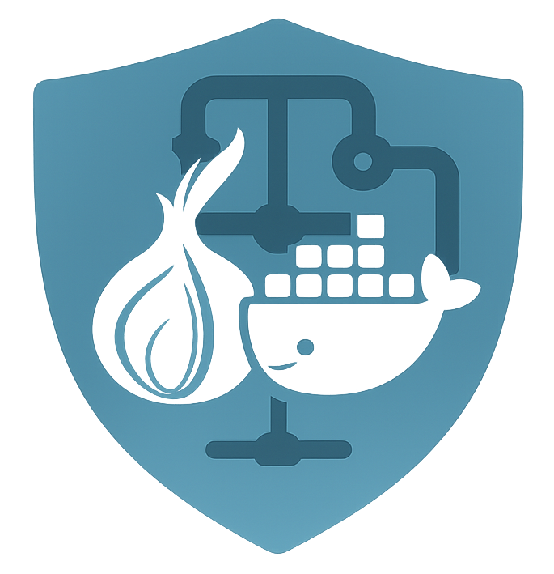

# KEWNIX: TOR-Gateway Container Orchestrator

<p align="center">
  
</p>

**Kewnix** is a hardened, modular orchestration system for routing Docker containers through a transparent, isolated Tor gateway, all while keeping your host system clean, untouched, and hardened.

> Built by **[Kewbit](https://kewbit.org)** with **security**, **transparency**, and **modularity** in mind.

---

## 🧪 One-Liner Installer

```bash
bash <(curl -fsSL https://gist.githubusercontent.com/KewbitXMR/a5a781978f636aece211c63bc0bd958b/raw/install-kewnix.sh)
```

Installs the CLI to `~/.local/bin/kewnix` and sets up everything you need.  
Works on any Linux host with Docker.

---

## 🔐 Features

- ✅ **Transparent Tor Gateway** — All traffic routed via a hardened Tor container
- ✅ **No NET_ADMIN in containers** — All rules enforced on the host
- ✅ **Strict circuit isolation** — Per-container SOCKS circuit isolation
- ✅ **No DNS leaks** — DNS routed through Tor only
- ✅ **Zero trust network** — Containers can't talk to each other unless allowed
- ✅ **Host-level iptables** — Tagged rules in `TOR_ORCH*` chains
- ✅ **Safe cleanup** — Rules, files, and containers removed without breaking host
- ✅ **Modular CLI** — One command: `kewnix`

---

## 🚀 Quick Usage

```bash
kewnix init                 # Set up Tor Gateway and services from scratch
kewnix add-service          # Add a new container (image or Dockerfile)
kewnix remove-service <svc> # Remove service and cleanup rules
kewnix list-services        # List all active managed services
kewnix tail-logs            # Tail iptables logs (TOR_ORCH-tagged)
kewnix clean                # Safely remove everything created by Kewnix
```

---

## 🧱 Files & Layout

| File/Dir             | Purpose                                 |
|----------------------|-----------------------------------------|
| `kewnix`             | The command center CLI                  |
| `.tor_gateway_*.sh`  | Core orchestrator + service manager     |
| `docker-compose.yml`| Auto-generated orchestrator file        |
| `.access/`           | Who can talk to whom                    |
| `.state/`            | Tracks service state, subnet, etc       |
| `TOR_ORCH*`          | iptables chains for strict enforcement  |

---

Here’s the updated **Security Threat Matrix** for the Kewnix README, reflecting all current protections you've implemented through the recent updates, including `seccomp`, AppArmor integration scaffolding, hardened iptables, and Docker isolation:

---

## 🔐 Security Threat Matrix

| **Attack Vector**                                  | **Covered?** | **Explanation / Notes**                                                                 |
|----------------------------------------------------|--------------|------------------------------------------------------------------------------------------|
| **Clearnet traffic leaks**                         | ✅ Yes       | Host-level iptables force all outbound traffic through `192.168.100.2:9050` only         |
| **DNS leaks**                                      | ✅ Yes       | DNS is redirected via iptables to Tor internal resolver (`127.0.0.1`)                   |
| **Container-to-container lateral movement**        | ✅ Yes       | Each container uses its own Docker bridge network and isolated subnet                   |
| **Privileged container abuse / NET_ADMIN**         | ✅ Yes       | `NET_ADMIN` is never granted; all firewalling is host-side only                         |
| **Accessing host files via mount volumes**         | ✅ Yes       | No host bind mounts; containers run with `read_only: true` by default                   |
| **Docker socket exposure (`/var/run/docker.sock`)**| ✅ Yes       | Never exposed to any container                                                          |
| **Public IP discovery via external IP check**      | ✅ Yes       | Outbound traffic strictly blocked except to Tor — no clearnet IP resolution possible     |
| **ICMP scanning or LAN discovery**                 | ✅ Yes       | Dropped via iptables and no Docker route outside own subnet                             |
| **Outbound UDP abuse (e.g. STUN, WebRTC)**         | ✅ Yes       | All outbound UDP blocked, except DNS routed to Tor (`5353`)                             |
| **Kernel syscall abuse from within container**     | ⚠️ Partial   | `seccomp` profile supported, now configurable per service                               |
| **Container escape via known Docker vulnerabilities**| ⚠️ Partial | AppArmor scaffolding added; enforcement depends on user's system + container choice     |
| **Tor gateway compromise → leaks all traffic**     | ⚠️ Partial   | Hardened with read-only root, dropped capabilities, and isolated network, but shared     |
| **Container inferring host info via `proc`, `/sys`**| ⚠️ Partial   | Mitigated via optional seccomp + limited by container isolation                         |
| **Container accessing MAC/IP info of other networks**| ✅ Yes       | Containers see only their Docker bridge, no external MAC/IP discovery possible          |
| **Leak via application-layer metadata (e.g. HTTP headers)**| ⚠️ WIP    | App-level deep packet inspection optional, will drop packets with known IP or host content                        |                  |

---


## 🧹 Cleanup

Run:
```bash
kewnix clean
```

This will:

- Stop and delete all managed containers
- Remove `docker-compose.yml`, `.access/`, `.state/`
- Drop all `TOR_ORCH`-tagged iptables rules
- Ask before removing Docker volumes
- Skip anything not created by the orchestrator

---

## 📦 Gist Installer

Your source is here:

**https://gist.github.com/KewbitXMR/a5a781978f636aece211c63bc0bd958b**

It contains:

- `install-kewnix.sh`
- `kewnix`
- `.tor_gateway_docker_orchestrator.sh`
- `.tor_gateway_service_manager.sh`
- `.tor_gatewat_hardening.sh`

> Automatically updated, users running the installer will always get the latest version.

---

## 💡 Future Roadmap

- [ ] CLI autocompletion
- [ ] Health check retries
- [ ] Live metrics via WebSocket
- [ ] Optional Whonix-style split-gateway container
- [ ] Bridge client container to non-Tor fallback

---

## 🤝 Contribute

PRs welcome. Keep it POSIX, and paranoia-approved.

---

## ☠️ Disclaimer

This tool assumes **containers may be compromised**.

Kewnix is not a privacy layer, it is a **firewall and routing enforcer** for *already-anonymized* workloads.  
If you want to secure a container or app from itself and from affecting your main system, you want this. If you're using NGINX… maybe not.

---

## 🔗 License

MIT